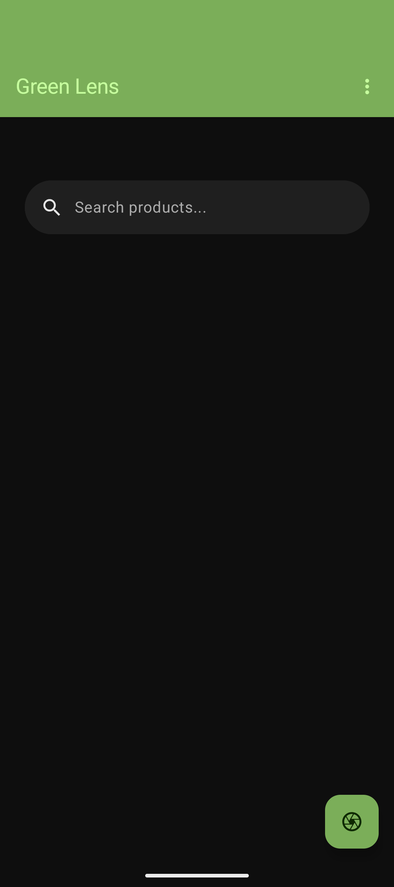
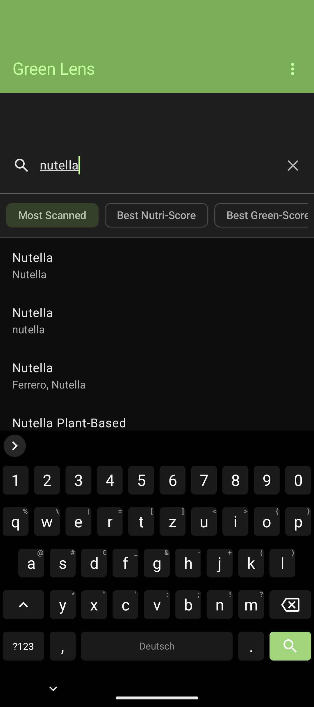
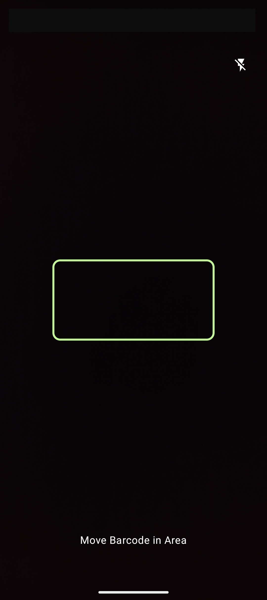
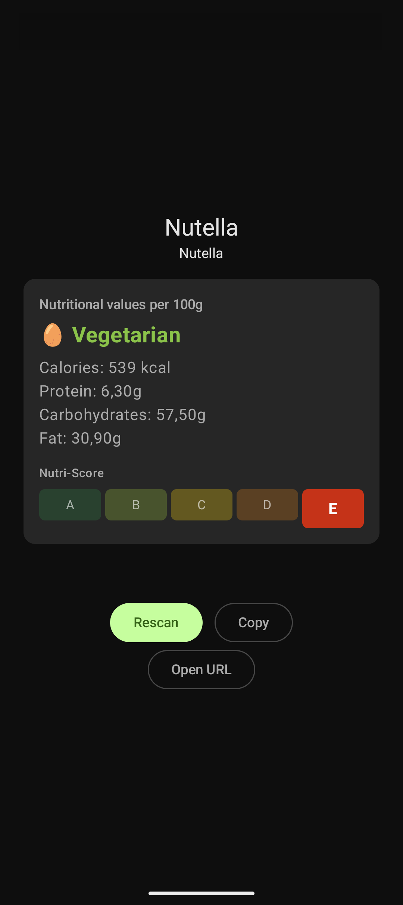

# Green Lens

<p align="center">
  
</p>

<p align="center">
  <strong>An Android app that lets you scan product barcodes or search for products to view nutritional information and dietary labels (vegan/vegetarian).</strong>
</p>

<p align="center">
  <a href="https://www.android.com/"></a>
  <a href="https://developer.android.com/about/versions/oreo/"></a>
  <a href="https://kotlinlang.org/"></a>
  <a href="https://developer.android.com/jetpack/compose"></a>
  <a href="https://developer.android.com/studio/releases/platforms"></a>
  <a href="https://developer.android.com/studio/releases/build-tools"></a>
  <a href="LICENSE"></a>
</p>

---

## 📱 Features

- **Barcode Scanner** – Scan product barcodes using your camera
- **Product Search** – Search for products by name
- **Sort the Searched** – Sort the search results
- **Nutritional Info** – View calories, protein, carbohydrates and fat per 100g
- **Dietary Labels** – See whether a product is vegan or vegetarian
- **Nutri-Score** – See the nutri score of the product
- **Open Website** – Open the Open Food Facts website directly through the app
- **Material 3** – Beautiful Material 3 Theme that matches the Android UI
- **Clipboard** – Copy barcodes with one tap

---

## 📷 Screenshots
<p align="center">
  
  
  
  
</p>

---

## 🛠️ Tech Stack

| Technology | Usage |
|---|---|
| Kotlin | Programming language |
| Jetpack Compose | UI |
| CameraX | Barcode scanning |
| ML Kit | Barcode detection |
| Ktor | HTTP client |
| Kotlinx Serialization | JSON parsing |
| MVVM | Architecture |
| OpenFoodFacts API | Product data |

---

## 📦 Dependencies

```kotlin
// CameraX
implementation("androidx.camera:camera-core:1.4.2")
implementation("androidx.camera:camera-camera2:1.4.2")
implementation("androidx.camera:camera-lifecycle:1.4.2")
implementation("androidx.camera:camera-view:1.4.2")
implementation("androidx.camera:camera-mlkit-vision:1.4.2")
implementation("androidx.camera:camera-compose:1.6.0")

// ML Kit
implementation("com.google.mlkit:barcode-scanning:17.3.0")

// Ktor
implementation("io.ktor:ktor-client-android:2.3.7")
implementation("io.ktor:ktor-client-content-negotiation:2.3.7")
implementation("io.ktor:ktor-serialization-kotlinx-json:2.3.7")

// Licenses
implementation("com.mikepenz:aboutlibraries-compose-m3:11.2.3")

// Splash Screen
implementation("androidx.core:core-splashscreen:1.0.1")
```

---

## 🏗️ Architecture

The app follows the **MVVM (Model-View-ViewModel)** architecture pattern.

```
de.gosmik.greenlens/
├── data/
│   ├── barcode/
│   └── openfoodfacts/
│       ├── model/
│       ├── api/
│       └── repository/
└── ui/
    ├── screen/
    │   ├── main/
    │   ├── barcode/
    │   └── licenses/
    ├── components/
    └── theme/
```

---

## 🚀 Getting Started

### Prerequisites

- Android Studio Meerkat or newer
- Android SDK 24+
- Kotlin 2.3+

### Installation

1. Clone the repository
```bash
git clone https://github.com/gosmik/greenlens.git
```

2. Open the project in Android Studio

3. Build and run on your device or emulator

---

## 🤝 Contributing

Contributions are welcome! Feel free to open an issue or submit a pull request.

---

## 🌍 Data Source

Product data is provided by [OpenFoodFacts](https://world.openfoodfacts.org/) – a free, open and collaborative food products database.

---

## 📄 License

This project is licensed under the **GNU General Public License v3.0** – see the [LICENSE](LICENSE) file for details.
